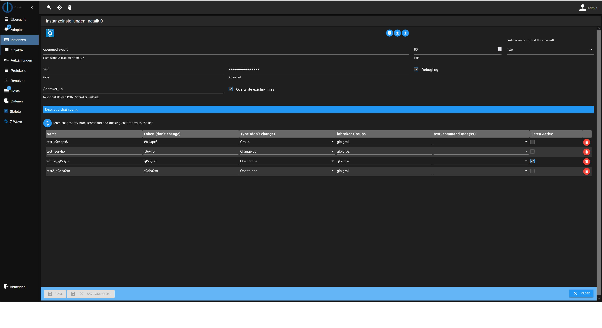
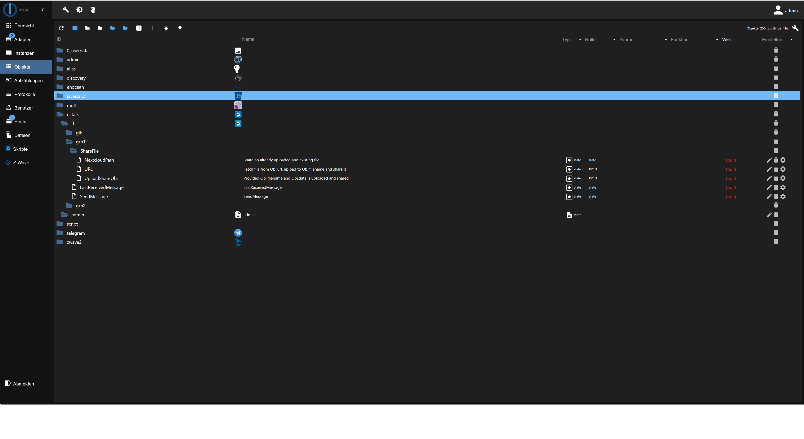

# ioBroker.nctalk

[](https://www.npmjs.com/package/iobroker.nctalk)
[](https://www.npmjs.com/package/iobroker.nctalk)


[](https://david-dm.org/jjqoie/iobroker.nctalk)

[](https://nodei.co/npm/iobroker.nctalk/)

**Tests:** 

## nctalk adapter for ioBroker

Use nextcloud Talk service to communicate with ioBroker, push notification and sending commands to control your smarthome





## How to use

### Configuration
- Name - for later use maybe. No need to change it.<br />
- Token - unique id of a talk chatroom (don't change, in the future this column will be made read only)<br />
- Type - talk supports different types of chatrooms "One to one", "Group", "Public", "Changelog". Not used, just additional information for the admin. (don't change)<br />
- iobrokergroup - assigns a talk chatroom to one or multiple iobroker group. Group-Names are sperated by comma ","<br />
- text2command - not implemented yet<br />
- Listen Active - If activated the chatroom will be polled for new messages available.

### Object description
- **nctalk.*i.iobrokergroupname*.LastReceivedMessage** - Shows last received message of this iobrokergroup as string. No queuing mechanism is currently implemented. Means in case two messages arrive almost at the same time only the earlier message might be lost.
- **nctalk.*i.iobrokergroupname*.SendMessage** - Sends string to the every talk chatroom in the same iobrokergroup<br />
- **nctalk.*i.iobrokergroupname*.ShareFile.NextcloudPath** - path to ane existing file in nextcloud for example "/Photos/Birdie.jpg"<br />
- **nctalk.*i.iobrokergroupname*.ShareFile.URL** - Object/JSON with two elements filename = filename to be created and the url to the ressource on the web where to download the file. Example {"filename": "snapshot.jpg", "url": "https://<username>:<password>@192.168.XXX.XXX/cgi-bin/currentpic.cgi"} <br />
- **nctalk.*i.iobrokergroupname*.ShareFile.UploadShareObj** - Object/JSON with two elements filename = filename to be created and Buffer with binary data of the file. Example {"filename": "dafang02.png", "data": {"type": "Buffer","data": [ 255, 216, 255, 224, ....]}}
<br />


### Limitations
No queuing mechanism with handshake (producer/consumer) using the acknowledge function is implemented yet. This can lead to losing messages in case of simultaneously requests. 

### Examples

####  Share existing file using **ShareFile.NextcloudPath**<br/> - string to file path inside the user's root
```
"/Photos/Birdie.jpg"
```

#### Share file from web using **ShareFile.URL**
Allows self signed certificates and simple authentication using username:password@
```js
{"filename": "snapshot.jpg", "url": "https://<username>:<password>@192.168.XXX.XXX/cgi-bin/currentpic.cgi"}
```
#### Blockly example from Karsten using **ShareFile.URL** - https://forum.iobroker.net/topic/49298/neuer-adapter-nextcloud-talk-messenger/53?_=1641974071507


#### Share file from local disk using **UploadShareObj**
```js
var fs = require("fs");

fs.readFile("/opt/iobroker/iobroker-data/tmp/dafang01/dafang01.png", null , (err, data) => {
    if (err) {
        console.error(err)
        return
    }

    const fileNextcloud = {
        filename: "tests123.png",
        data: data
    }
    //console.log(fileNextcloud)
    setState("nctalk.0.kjf53yuu.ShareFile.UploadShareObj", fileNextcloud);
})
```

#### Share file from web using **UploadShareObj**
```js
var https = require("https");

var options = {
    host: 'raw.githubusercontent.com',
    port: 443,
    path: '/jjqoie/iobroker.nctalk/main/img/nctalk-objects.png',
    method: 'GET',
};

https.get(options, function(res) {
    res.setEncoding('binary');
    let chunks = [];

    res.on('data', (chunk) => {
        chunks.push(Buffer.from(chunk, 'binary'));
    });

    res.on('end', () => {
        let binary = Buffer.concat(chunks);
        // binary is now a Buffer that can be used as Uint8Array or as
        // any other TypedArray for data processing in NodeJS or 
        // passed on via the Buffer to something else.

        });
        const fileNextcloud = {
            filename: "snapshot.png",
            data: binary
        }
        setState("nctalk.0.grp2.ShareFile.UploadShareObj", fileNextcloud);
    });
});
```

## Developer manual
This section is intended for the developer. It can be deleted later

### Getting started

You are almost done, only a few steps left:
1. Create a new repository on GitHub with the name `ioBroker.nctalk`
1. Initialize the current folder as a new git repository:  
    ```bash
    git init -b main
    git add .
    git commit -m "Initial commit"
    ```
1. Link your local repository with the one on GitHub:  
    ```bash
    git remote add origin https://github.com/jjqoie/ioBroker.nctalk
    ```

1. Push all files to the GitHub repo:  
    ```bash
    git push origin main
    ```

1. Head over to [main.js](main.js) and start programming!

### Best Practices
We've collected some [best practices](https://github.com/ioBroker/ioBroker.repositories#development-and-coding-best-practices) regarding ioBroker development and coding in general. If you're new to ioBroker or Node.js, you should
check them out. If you're already experienced, you should also take a look at them - you might learn something new :)

### Scripts in `package.json`
Several npm scripts are predefined for your convenience. You can run them using `npm run <scriptname>`
| Script name | Description |
|-------------|-------------|
| `test:js` | Executes the tests you defined in `*.test.js` files. |
| `test:package` | Ensures your `package.json` and `io-package.json` are valid. |
| `test:unit` | Tests the adapter startup with unit tests (fast, but might require module mocks to work). |
| `test:integration` | Tests the adapter startup with an actual instance of ioBroker. |
| `test` | Performs a minimal test run on package files and your tests. |
| `check` | Performs a type-check on your code (without compiling anything). |
| `lint` | Runs `ESLint` to check your code for formatting errors and potential bugs. |
| `release` | Creates a new release, see [`@alcalzone/release-script`](https://github.com/AlCalzone/release-script#usage) for more details. |

### Writing tests
When done right, testing code is invaluable, because it gives you the 
confidence to change your code while knowing exactly if and when 
something breaks. A good read on the topic of test-driven development 
is https://hackernoon.com/introduction-to-test-driven-development-tdd-61a13bc92d92. 
Although writing tests before the code might seem strange at first, but it has very 
clear upsides.

The template provides you with basic tests for the adapter startup and package files.
It is recommended that you add your own tests into the mix.

### Publishing the adapter
Using GitHub Actions, you can enable automatic releases on npm whenever you push a new git tag that matches the form 
`v<major>.<minor>.<patch>`. We **strongly recommend** that you do. The necessary steps are described in `.github/workflows/test-and-release.yml`.

Since you installed the release script, you can create a new
release simply by calling:
```bash
npm run release (minor/major/patch -- --dry)
```
Additional command line options for the release script are explained in the
[release-script documentation](https://github.com/AlCalzone/release-script#command-line).

To get your adapter released in ioBroker, please refer to the documentation 
of [ioBroker.repositories](https://github.com/ioBroker/ioBroker.repositories#requirements-for-adapter-to-get-added-to-the-latest-repository).

### Test the adapter manually with dev-server
Since you set up `dev-server`, you can use it to run, test and debug your adapter.

You may start `dev-server` by calling from your dev directory:
```bash
dev-server watch
```

The ioBroker.admin interface will then be available at http://localhost:8081/

Please refer to the [`dev-server` documentation](https://github.com/ioBroker/dev-server#command-line) for more details.

## Changelog
<!--
    Placeholder for the next version (at the beginning of the line):
    ### **WORK IN PROGRESS**
-->
### **WORK IN PROGRESS**
* (Jochen Gerster) Fix missing uk translations warning of automated adapter checker

### 0.3.1 (2023-02-23)
* (Jochen Gerster) fix issues found by adapter checker
* (Jochen Gerster) Ensure object id does not contain an invalid character
* (Jochen Gerster) Update to nctalkclient 1.5.0

### 0.3.0 (2022-01-07)
* (Jochen Gerster) Added FileSharing

### 0.2.0 (2021-11-23)
* (Jochen Gerster) Added debug logging option

### 0.1.0 (2021-11-13)
* (Jochen Gerster) initial release

## License
MIT License

Copyright (c) 2023 Jochen Gerster <jjqoie@gmx.de>

Permission is hereby granted, free of charge, to any person obtaining a copy
of this software and associated documentation files (the "Software"), to deal
in the Software without restriction, including without limitation the rights
to use, copy, modify, merge, publish, distribute, sublicense, and/or sell
copies of the Software, and to permit persons to whom the Software is
furnished to do so, subject to the following conditions:

The above copyright notice and this permission notice shall be included in all
copies or substantial portions of the Software.

THE SOFTWARE IS PROVIDED "AS IS", WITHOUT WARRANTY OF ANY KIND, EXPRESS OR
IMPLIED, INCLUDING BUT NOT LIMITED TO THE WARRANTIES OF MERCHANTABILITY,
FITNESS FOR A PARTICULAR PURPOSE AND NONINFRINGEMENT. IN NO EVENT SHALL THE
AUTHORS OR COPYRIGHT HOLDERS BE LIABLE FOR ANY CLAIM, DAMAGES OR OTHER
LIABILITY, WHETHER IN AN ACTION OF CONTRACT, TORT OR OTHERWISE, ARISING FROM,
OUT OF OR IN CONNECTION WITH THE SOFTWARE OR THE USE OR OTHER DEALINGS IN THE
SOFTWARE.
